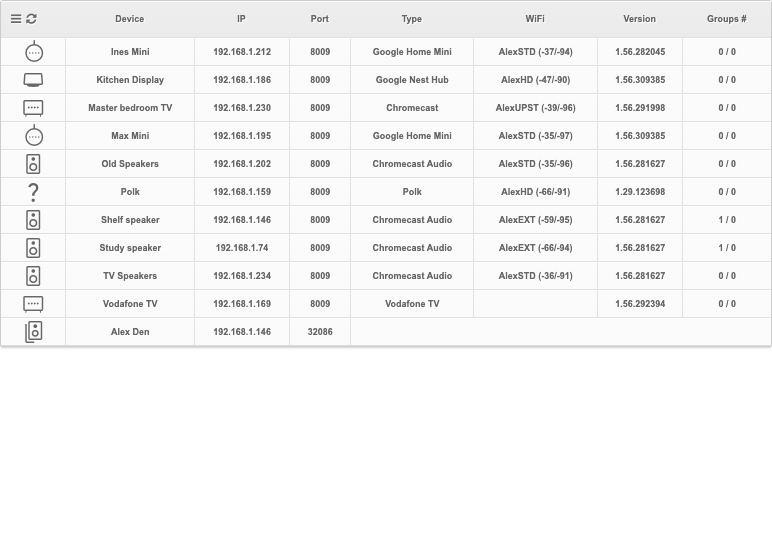
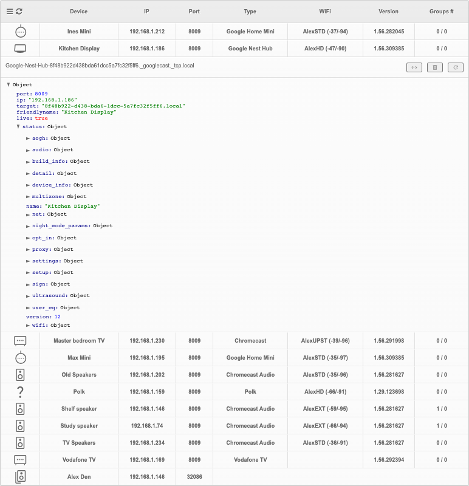
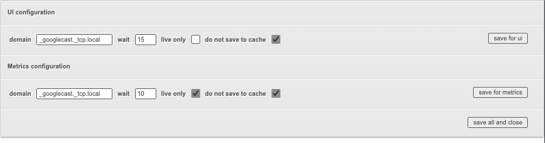

## About

Web-based GoogleCast devices explorer and monitor.

Based on https://github.com/ChrisRidings/CastV2inPHP for the MDNS bit.

Uses https://github.com/mohsen1/json-formatter-js for detailed output of device status.

## How it works

- Step 1: uses mdns discovery to find Google Cast devices on your network
- Step 2: queries each device discovery URL to get its status
  - using https://\<IP\>:8443/setup/eureka_info
  - if it fails (as some devices do) or times out, using the less rich output from http://\<IP\>:8008/setup/eureka_info
- Step 3: ???
- Step 4: profit... I mean, shows a nice web UI with the result

## How to use it

clone the repo and use your favourite PHP web server to host

## Features

List of devices



Details for a single device



Settings



## Notes

- UI is designed to be embedded in an iFrame (in Home Assistant for instance) - that's why the UI is so compact
- Obviously, the server hosting the page needs to be on the same network as the GoogleCast devices

## Prometheus mode

- Use /metrics.php
- Available KPIs
  - Number of devices found via mDNS during the wait time
  - Response time for eureka_info API call (on HTTP port)

### Example

```
scrape_configs:
  - job_name: "castplorer"
    scrape_interval: 2m
    scrape_timeout: 30s
    static_configs:
      - targets: ['X.X.X.X:80']
    metrics_path: /castplorer/metrics.php
```